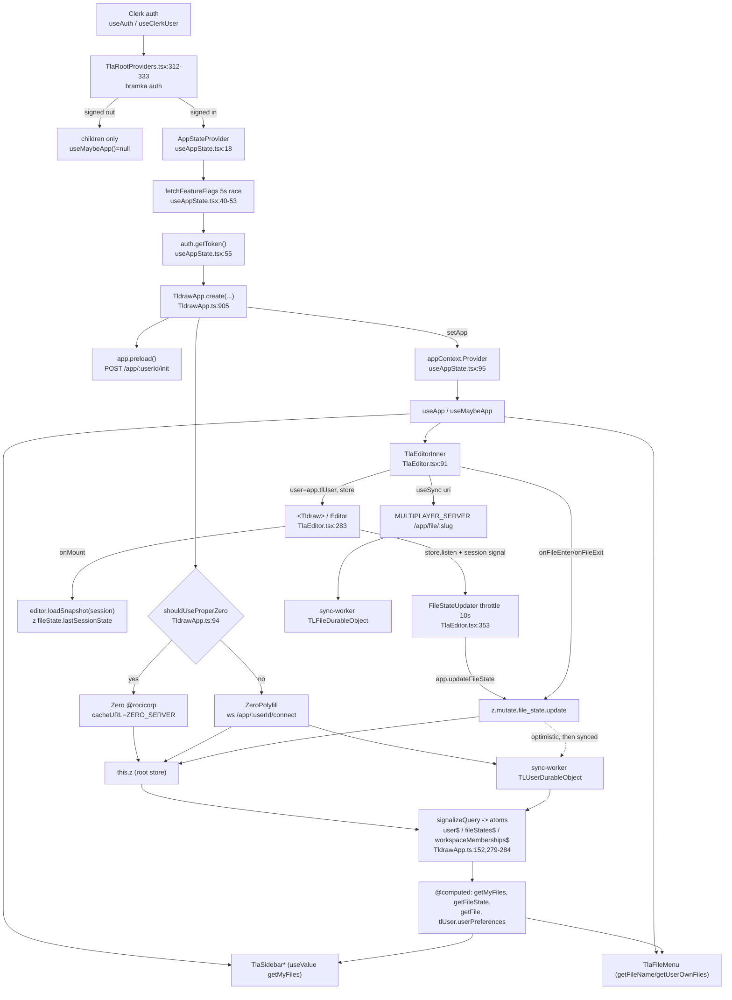

# Research: Przepływ stanu aplikacji dotcom przez `useAppState`

**Date**: 2026-06-17T19:08:48-0500
**Researcher**: Rafal S
**Git Commit**: 2d148be9384323555a42c6097e5a04cbc90ef612
**Branch**: learning/m4-architect
**Repository**: tldraw

## Research Question

Przeanalizuj przepływ stanu aplikacji dotcom (tldraw.com) przez `useAppState` — jak skleja edytor z workspace/file state, auth, sync/multiplayer oraz UI, i gdzie ten przepływ jest kruchy, trudny do testowania albo ma duży blast radius. Analiza obecnego stanu repo; bez propozycji refaktoru.

## Summary

`useAppState` **nie jest** prawdziwym god-hookiem — to cienki wrapper na React Context (104 linie,
`apps/dotcom/client/src/tla/hooks/useAppState.tsx`). Prawdziwym "god objectem" jest instancja
**`TldrawApp`** (`apps/dotcom/client/src/tla/app/TldrawApp.ts`, ~1200+ linii), którą hook publikuje przez
kontekst. Sercem `TldrawApp` jest **jeden klient Zero** (`this.z`, `TldrawApp.ts:129`), do którego sprowadza
się cały trwały stan aplikacji (user, file_states, workspaces). Stan ten jest mostkowany do systemu sygnałów
`@tldraw/state` przez `signalizeQuery` (`TldrawApp.ts:152-180`), a komponenty czytają go przez `@computed`
gettery opakowane w `useValue`.

Trzy kluczowe ustalenia:

1. **Realny blast radius leży o warstwę niżej niż `useAppState`.** ~50 komponentów konsumuje hook, ale
   prawdziwe sprzężenie to typy/mutatory w `@tldraw/dotcom-shared` (importowane przez **73 pliki**, w tym
   sync-worker i migracje zero-cache). Zmiana schematu = zmiana klienta + workera + migracji DB **razem**.
2. **Brak izolacji testowej.** Nie istnieje żaden `TestAppState` / fabryka / mock dla `TldrawApp` — w
   przeciwieństwie do SDK, które ma `TestEditor`. `TldrawApp` jest niemożliwy do instancjonowania w teście
   jednostkowym bez sieci (konstruktor bezwarunkowo otwiera Zero/WebSocket). Pokrycie ścieżki stanu jest
   **wyłącznie e2e** (Playwright + realny Clerk + worker + DB).
3. **Dwa kanały sync.** Dane app-list (user/file_state/workspaces) idą przez Zero; treść per-dokument idzie
   osobno przez `@tldraw/sync` `useSync`. `FileStateUpdater` to most między edytorem a file_state.

---

## Feature overview

### Skąd wchodzi przepływ (entry points)

- **EVIDENCE** — Router lazy-ładuje providery dla wszystkich tras `tla*`: `routes.tsx:64`
  (`lazy={() => import('./tla/providers/TlaRootProviders')}`).
- **EVIDENCE** — `TlaRootProviders.tsx` to prawdziwa bramka auth, która decyduje czy `AppStateProvider` w ogóle
  się zamontuje:
  - `TlaRootProviders.tsx:280` — `!auth.isLoaded` → `null`.
  - `TlaRootProviders.tsx:312` — wylogowany branch: renderuje `children` **bez** `AppStateProvider`
    (więc `useMaybeApp()` zwraca `null` w dół drzewa).
  - `TlaRootProviders.tsx:322-333` — dopiero przy signed-in + loaded renderuje
    `<AppStateProvider><UserProvider>...`.
- **EVIDENCE** — `useAppState.tsx:30-32` rzuca `throw new Error('should have redirected in TlaRootProviders')` —
  to **defensywny invariant**, nie realna bramka (realna jest w `TlaRootProviders`).

### Jak dane/stany przepływają przez `useAppState` (sekwencja)

Wszystko w `useAppState.tsx` o ile nie zaznaczono inaczej (EVIDENCE):

1. Auth resolves (Clerk) → provider montuje się (`TlaRootProviders.tsx:322`).
2. Feature flags z timeoutem — `:40-53`: `fetchFlagsWithTimeout()` ściga `fetchFeatureFlags()` z 5s timeoutem
   (`DEFAULT_FLAGS`). Jeśli `!wasAuthenticated()` — fetch drugi raz (`:51-53`).
3. Token z Clerka — `:55 await auth.getToken()`; rzuca jeśli brak (`:56`).
4. **`TldrawApp.create({...})`** — `:57-70`, przekazuje `userId`, `email`, `flags`, `getToken`,
   `onClientTooOld` (ustawia `isClientTooOld$`, `:65-67`), `trackEvent`, `navigate`.
   - W środku `create` (`TldrawApp.ts:905-957`): czyta lokalne `getUserPreferences()` (`:918`), bierze
     `initialToken` (`:920`), `new TldrawApp(...)` (`:921`), wystawia `window.app` (`:932`),
     `await app.preload()` (`:933`), a jeśli serwerowy user to `___INIT___` — seeduje preferencje
     `updateUser(...)`, odpala `create-user` i dialog powitalny (`:935-955`).
5. Guard anulowania — `:54, :71-74`: jeśli effect anulowany w locie, świeżo utworzony app jest disposowany.
6. Publikacja kontekstu — `:76 setApp(app)` → `:95 <appContext.Provider value={app}>`.
7. Konsumpcja — `useApp()` (`:101-103`, asercja non-null) i `useMaybeApp()` (`:98-100`). Cleanup `:81-86`
   disposuje app na unmount/re-key (`[auth.userId, user]`).

`UserProvider` (`useUser.tsx:15-58`) siedzi tuż w środku, wyprowadza `TldrawUser` z `app.getUser()` (`:30`),
pokazuje spinner dopóki `app` jest null (`:47`).

### Co jest źródłem stanu, a co pochodnym

**Źródła (w `TldrawApp.ts`):**

- **EVIDENCE** — `readonly z: Zero<TlaSchema, TlaMutators, ZeroContext>` (`:129`) — klient Zero to **root store**.
  Tworzony dwiema drogami (`:204-277`):
  - **Proper Zero** (`@rocicorp/zero`) — `cacheURL: ZERO_SERVER`, `kvStore: 'idb'|'mem'`, z odświeżaniem tokenu
    (`:230-235`) i reconnectem z backoffem przy błędzie auth (`:239-260`).
  - **`ZeroPolyfill`** (`./zero-polyfill`) — `ClientWebSocketAdapter` do `${MULTIPLAYER_SERVER}/app/${userId}/connect`
    (`:262-276`).
  - Wybór: `shouldUseProperZero(flags, email)` (`:94-113`).
- **EVIDENCE** — Trzy surowe sygnały to **zmaterializowane zapytania Zero**, tworzone w konstruktorze (`:279-284`)
  przez `signalizeQuery` (`:152-180`): `user$`, `fileStates$`, `workspaceMemberships$`. `signalizeQuery`
  woła `this.z.materialize(query)`, owija `.data` w `atom(...)` z `isEqual`, a na każdy callback Zero batchuje
  zmiany i flushuje w `queueMicrotask`/`transact`. **To jest most Zero → `@tldraw/state`.**
- **EVIDENCE** — `sidebarState = atom('sidebar state', {...})` (`:1149-1155`, rename/drag state),
  `tlUser = createTLCurrentUser(...)` (`:482-502`), oraz niereaktywne cache `lastRecentFileOrdering` /
  `lastWorkspaceFileOrderings` (`:517-530`).
- **EVIDENCE** — `queries` (`packages/dotcom-shared/src/queries.ts:22-39`): `user`, `fileStates` (z relacją
  `file`), `workspaceMemberships`. Uprawnienia egzekwowane serwerowo przez `ctx.userId`.

**Pochodne (computed / `useValue`):**

- **EVIDENCE** — `@computed` gettery: `getMyFiles()` (`:532`), `getUserFlags()` (`:401`),
  `getWorkspaceMemberships()` (`:429`); `tlUser.userPreferences` = `computed(... pick(getUser(), UserPreferencesKeys))`
  (`:483-489`); plain gettery: `getUser()` (`:397`), `getFileState(fileId)` (`:872-874`, liniowy `find`),
  `getFile(fileId)` (`:792-802`), `getUserOwnFiles()` (`:504-511`).
- **EVIDENCE** — Konsumenci owijają gettery w `useValue`: np. `TlaSidebarRecentFiles.tsx:13-16`
  (`getMyFiles`), `TlaSidebarFileLink.tsx:73` (`getFileName`), `TlaFileMenu.tsx:53-54`.

### Kto konsumuje wynik hooka

- **EVIDENCE** — ~53 call-sites w ~50 plikach, wszystkie pod `apps/dotcom/client/src/`. Podział:
  `useApp()` (~22 plików, wymaga app), `useMaybeApp()` (~28 plików, toleruje null), `isClientTooOld$` (1),
  `AppStateProvider` (1). Potwierdza to (z lekkim zawyżeniem) "51+" z `repo-map.md:79`.
- Klastry: provider/root (`TlaRootProviders.tsx:35,229,325`, `RequireSignedInUser.tsx:6`); editor
  (`TlaEditor.tsx:93,314` + `editor-components/*` + `sneaky/*`, ~12 plików); sidebar
  (`TlaSidebar/components/*`, ~9); share/file menu + dialogi (~10); hooki (`useUser`, `useIsFilePinned`,
  `useIsFileOwner`, `useActiveWorkspaceId`, `useHasFlag`, ... 9 hooków); strony (`pages/*`, ~9 — głównie
  tylko `useMaybeApp()?.userId`).

### Które pola/metody są najważniejsze (hot surface)

- **EVIDENCE** — najgorętsze metody (grep po `apps/dotcom/client/src`):
  - `app.getFile(fileId)` — ~8 sites.
  - `app.createFile(...)` — ~8 sites.
  - `app.getFileState` / `app.updateFileState` — `TlaEditor.tsx:143,245,266,403`, `TlaFileMenu:164/165`.
  - `app.getWorkspaceMembership(s)` / `getWorkspaceFilesSorted` — ~10 sites (najnowszy klaster, migracja workspaces).
  - **`app.z.mutate.*`** — **bezpośredni dostęp do klienta Zero z pominięciem metod `TldrawApp`** —
    `useDragTracking:129`, `WorkspaceSettingsDialog:102/114/129/202/296`, `TlaFileMenu:145/147/249/266/292`,
    `TlaSidebarWorkspaceList:176` (~12 sites).
  - `app.sidebarState` (atom), `app.tlUser` (`TlaEditor.tsx:202,215,289`), `app.userId` (~10 stron, trywialne).

### Gdzie realnie zmienia się stan (mutatory)

- **EVIDENCE** — wszystkie zapisy idą przez `this.z.mutate.*` (`TldrawApp.ts`): `createFile` (`:648-676`),
  `slurpFile` (`:754-758`), `toggleFileShared` (`:760-768`), `publishFile`/`unpublishFile` (`:776-790`/`:825-836`),
  `updateFile` (`:882-884`), `deleteOrForgetFile` (`:841-844`), `updateUser`/`updateUserExportPreferences`
  (`:856-862`/`:864-870`), `tlUser.setUserPreferences` (`:490-501`).
- **EVIDENCE** — pętla editor↔app: `updateFileState` (`:876-880` → `z.mutate.file_state.update`),
  `onFileEnter` (`:886-888`), `onFileExit` (`:901-903`), `onFileEdit` (`:890-892`),
  `onFileSessionStateUpdate` (`:894-899`).
- **EVIDENCE** — workspace/invite przez REST: `acceptWorkspaceInvite` (`:1178-1218`, `POST /api/app/invite/.../accept`),
  `copyWorkspaceInvite` (`:1158-1176`). Odrzucenia mutacji → `showMutationRejectionToast` (`:384-390`).

### Gdzie stan przechodzi do Editora / SDK / sync (boundary)

Crossing dzieje się w całości w `TlaEditor.tsx` (`TlaEditorInner`):

- **App → Editor (EVIDENCE):** `const app = useMaybeApp()` (`:93`); `user={app?.tlUser}` (`:289`);
  presence `users` z `app.tlUser.userPreferences` (`:201-215`); store z `useSync(...)` (`:217-230`,
  **niezależny od TldrawApp**); `onMount={handleMount}` (`:125-190`) czyta `app.getFileState(fileId)` (`:143`)
  i robi `editor.loadSnapshot({ session }, { forceOverwriteSessionState: true })` (`:151/:155`) +
  deep linki (`:152-160`).
- **Editor → App (EVIDENCE) — `FileStateUpdater` (`:353-418`):** słucha `editor.store.listen(..., {scope:'document', source:'user'})`
  (`:361-368`), śledzi `createSessionStateSnapshotSignal(editor.store)` + `react(...)` (`:377-390`),
  a `update` (throttle 10s, `FILE_STATE_UPDATE_INTERVAL = 10_000`) woła
  `app.updateFileState(fileId, { lastSessionState, lastEditAt, lastVisitAt })` (`:396-411`). `beforeunload`
  flushuje (`:369-375`).
- **Enter/exit (EVIDENCE):** `useEffect` (`:239-269`) czeka na `store.status === 'synced-remote'`, woła
  `app.onFileEnter(fileId)` (`:252/:259`), a na cleanup `app.updateFileState(fileId, { lastVisitAt })` (`:266`),
  z ochroną przed store-error (`:233-236, :265`).
- **INFERENCE** — `key={props.fileSlug}` (`:84-85`) wymusza remount przy zmianie pliku, żeby stan edytora nie
  przeciekał między plikami (potwierdza komentarz `:80`).

### Sync → MULTIPLAYER_SERVER → sync-worker

- **EVIDENCE** — `useSync` uri (`TlaEditor.tsx:217-224`): `new URL(\`${MULTIPLAYER_SERVER}/app/file/${fileSlug}\`)`
  - `accessToken`. `MULTIPLAYER_SERVER` (`config.ts:16-20`) = `${origin}/api` w prod, inaczej env var;
    `ZERO_SERVER` (`:22-25`) osobno.
- **EVIDENCE** — routy workera (`apps/dotcom/sync-worker/src/worker.ts`):
  `GET /app/file/:roomId` (`:135-140`, per-dokument `TLFileDurableObject`),
  `GET /app/:userId/connect` (`:106-122`, ZeroPolyfill → `TLUserDurableObject`),
  `POST /app/:userId/init` (`:123-129`, z `preload()` `TldrawApp.ts:306`),
  `POST /app/tldr` (`:130`).
- **INFERENCE** — **dwa kanały**: (a) app-list data (Zero / `/app/:userId/connect`), (b) per-dokument canvas
  (`useSync` / `/app/file/:roomId`). `updateFileState` idzie kanałem (a), edycje kształtów kanałem (b),
  a `FileStateUpdater` mostkuje (b)→(a).

### Diagram przepływu

---

## Technical debt

### Kruche sprzężenia

- **EVIDENCE — `app.z.mutate.*` omija fasadę (~12 sites).** Komponenty (`WorkspaceSettingsDialog`, `TlaFileMenu`,
  `useDragTracking`, `TlaSidebarWorkspaceList`) wołają mutatory Zero bezpośrednio, z pominięciem metod
  `TldrawApp`. Refaktor metod god-objectu **nie złapie** tych call-sites — tylko zmiana nazw mutatorów w
  dotcom-shared. To kruche i niewidoczne z poziomu hooka.
- **EVIDENCE — `app.tlUser` → SDK `<Tldraw user>` (`TlaEditor.tsx:289`).** Kształt `tlUser`
  (`createTLCurrentUser`, `TldrawApp.ts:482`) wchodzi w kontrakt user-store SDK (`TLUserStore`,
  `UserRecordType`, `UserPreferencesKeys`). **INFERENCE** — zmiana pól preferencji wymaga skoordynowanej
  edycji dotcom-shared + typu user-preferences w SDK.
- **EVIDENCE — sprzężenie z sync-workerem jest kodowe, nie tylko git.** `TldrawApp` importuje
  `schema as zeroSchema`, `createMutators`, `queries`, `ZeroContext` z dotcom-shared; **te same
  `createMutators`/schema importuje serwer** (`sync-worker/src/TLUserDurableObject.ts`, `worker.ts`).
  `Z_PROTOCOL_VERSION` (`TldrawApp.ts:267`) to wspólna stała protokołu — `onClientTooOld`/`isClientTooOld$`
  istnieją właśnie po to, by wersje klienta i workera się zgadzały.

### Brakujące testy

- **EVIDENCE — nie istnieje `TestAppState` / fabryka / mock / provider testowy dla `TldrawApp`.** Grep
  `TestApp|createTestApp|mockTldrawApp|FakeApp` po całym repo zwraca tylko docsy. Kontrast: SDK ma
  `class TestEditor extends Editor` (`packages/tldraw/src/test/TestEditor.ts:1`, in-memory store, fake timers).
  **Dotcom nie ma odpowiednika.**
- **EVIDENCE — `TldrawApp` niemożliwy do instancjonowania w unit-teście bez sieci.** Konstruktor
  (`TldrawApp.ts:186-285`) bezwarunkowo tworzy klienta sync (`new Zero(...)` → `ZERO_SERVER` lub
  `ZeroPolyfill` → WebSocket), ustawia interwały odświeżania tokenu i woła `await app.preload()` (`:933`).
  **Brak seamu iniekcji fake `z`.** Dlatego testowane są tylko wyekstrahowane czyste helpery.
- **EVIDENCE — jedyne realne unit-testy w tej okolicy:** `shouldUseProperZero.test.ts:30-170` (czysta funkcja
  decyzyjna, mock `getFromLocalStorage`), `ast-helpers.test.ts:4-401` (helpery polyfilla),
  `FeatureFlagPoller.test.ts`, `routes.test.tsx:109-186`. **Żaden nie instancjonuje `TldrawApp` ani nie
  renderuje konsumenta hooka.**
- **EVIDENCE — 0 testów komponentowych/hookowych.** Żaden `*.test.*` w `apps/dotcom/client/src` nie używa
  `@testing-library` / `render(` / `renderHook`. jsdom jest skonfigurowany (`vitest.config.ts:10`) — testy są
  technicznie możliwe, po prostu nie napisane.
- **EVIDENCE — pokrycie ścieżki stanu jest wyłącznie e2e (Playwright, realny stack).** Wszystkie 13 speców pod
  `apps/dotcom/client/e2e/tests/` wymaga realnego Clerka (`tla-test.ts:70`), działającego workera
  (`localhost:3000`) i realnego Zero/sync + DB (`database.reset()`, `tla-test.ts:71`).

### Brakujące branche błędów / edge cases

- **EVIDENCE — pokryte tylko e2e:** "client too old" (`client-too-old.spec.ts:1-22`, endpoint testowy workera).
- **EVIDENCE — NIE pokryte:** `store.status === 'error'` (`TlaEditor.tsx:234-236, 263-268`); token failures
  (`useAppState.tsx:55-56` `'no token'`, backoff `TldrawApp.ts:237-259`); slurping failures
  (`slurping.tsx`/`SlurpFailure.tsx` — jedyny e2e to `legacy.spec.ts`, gdzie **każdy test jest `test.fixme`**);
  flag-fetch timeout/race i `didCancel` cleanup (`useAppState.tsx:39-53, 71-86`); asercja `useApp`
  (`:102`). `signin-dialog.spec.ts` ma ~34 z ~40 testów jako `test.skip` (`:161-490`).

### God-hook / god-object symptoms

- **INFERENCE** — etykieta "god-hook na `useAppState`" z `repo-map.md` jest **myląca**: hook ma 104 linie i 3
  eksporty. God-objectem jest `TldrawApp` (~1200 linii), którego publiczna powierzchnia łączy: auth-token
  refresh (`:219-260`), klient Zero, file CRUD, workspace/invite (REST), user preferences, toasts,
  feature flags, slurping, scratch persistence. Jeden obiekt skleja wszystkie domeny dotcom.
- **EVIDENCE** — dowód koncentracji: `this.z` (`:129`) jest jedynym źródłem trwałego stanu; trzy sygnały
  (`user$`/`fileStates$`/`workspaceMemberships$`) materializują _wszystko_, co czytają komponenty.

### Miejsca o dużym blast radius

- **EVIDENCE — największy: typy/mutatory `@tldraw/dotcom-shared` (73 pliki, 74 wystąpienia).** `TlaFile`
  (`tlaSchema.ts:293`), `TlaFileState` (`:294`), `TlaUser` (`:292`), `TlaGroup` (`:295`), `TlaSchema` (`:291`),
  `TlaMutators` (`mutators.ts:71`), `ZeroContext` (`queries.ts:7`). Importują je: klient, **sync-worker (9+
  plików:** `ServerCrud.ts`, `TLUserDurableObject.ts`, `UserDataSyncer.ts`, `TLPostgresReplicator.ts`,
  `TLFileDurableObject.ts`, `adminRoutes.ts`...**)**, migracje zero-cache. **INFERENCE** — zmiana wiersza
  `Tla*` lub sygnatury mutatora to zmiana schema-level: klient + worker + migracje DB **razem**.

### Dynamiczne sprzężenia niewidoczne w importach

- **EVIDENCE** — `window.app = app` (`TldrawApp.ts:932`, `TlaEditor.tsx:130`); `window.editor` +
  `globalEditor.set(editor)` (`TlaEditor.tsx:131-133`); `window.zero()` dev escape hatch
  (`TldrawApp.ts:116`, przełącza Zero/polyfill przez localStorage). Rename publicznych metod psuje e2e/konsolę
  niewidocznie.
- **EVIDENCE** — sygnały/atomy czytane przez `useValue` (`app.sidebarState`, `app.user$`/`fileStates$`/
  `workspaceMemberships$`) — sprzężenie reaktywne, nie zwykłe wywołanie metody.

### Co wygląda groźnie, ale jest tanie/mechaniczne

- **EVIDENCE** — ~9 stron `pages/*` czyta tylko `useMaybeApp()?.userId`; `app.toasts`, `app.hasFlag`,
  `app.copyWorkspaceInvite`, helpery flag — rename to czysty find-replace, niskie ryzyko.
- **EVIDENCE** — rozróżnienie `useApp()` (22, wymaga app) vs `useMaybeApp()` (28, toleruje null): konsumenci
  `useMaybeApp` już mają guard `if (!app)`, więc są odporni na nieobecność app.

### Obszary, których nie dało się potwierdzić (unknown)

- **UNKNOWN** — dokładna serwerowa persystencja każdego mutatora (Postgres via replicator) — wnioskowana z nazw
  (`onEnterFile`, `removeFileFromWorkspace`), nie czytana linia po linii (`createMutators`/DO internals).
- **UNKNOWN** — zawartość `apps/dotcom/client/setupTests.js` (zakładane generyczne setup jsdom; gdyby stubował
  Clerk/Zero globalnie, mógłby umożliwić testy komponentowe — ale żaden test obecnie z tego nie korzysta).
- **UNKNOWN** — czy testy worker-side (`apps/dotcom/*-worker`) pośrednio asertują kontrakty mutatorów
  `TldrawApp` (poza zakresem; nie sprawdzono).

---

## Code references

- `apps/dotcom/client/src/tla/hooks/useAppState.tsx:18-103` — `AppStateProvider`, `useApp`, `useMaybeApp`, `isClientTooOld$`.
- `apps/dotcom/client/src/tla/app/TldrawApp.ts:129` — `this.z` (klient Zero, root store).
- `apps/dotcom/client/src/tla/app/TldrawApp.ts:152-180` — `signalizeQuery` (most Zero → `@tldraw/state`).
- `apps/dotcom/client/src/tla/app/TldrawApp.ts:279-284` — `user$` / `fileStates$` / `workspaceMemberships$`.
- `apps/dotcom/client/src/tla/app/TldrawApp.ts:94-113` — `shouldUseProperZero`; `:905-957` — `create()`.
- `apps/dotcom/client/src/tla/app/TldrawApp.ts:876-903` — file-state mutatory (`updateFileState`/`onFileEnter`/`onFileExit`).
- `apps/dotcom/client/src/tla/components/TlaEditor/TlaEditor.tsx:91-311` — boundary app ↔ Editor.
- `apps/dotcom/client/src/tla/components/TlaEditor/TlaEditor.tsx:353-418` — `FileStateUpdater`.
- `apps/dotcom/client/src/tla/providers/TlaRootProviders.tsx:280-333` — bramka auth.
- `packages/dotcom-shared/src/tlaSchema.ts:291-295` — typy `Tla*`; `mutators.ts:71`; `queries.ts:7,22-39`.
- `apps/dotcom/sync-worker/src/worker.ts:106-140` — routy sync; `TLUserDurableObject.ts`, `TLFileDurableObject.ts`.
- `apps/dotcom/client/src/tla/app/shouldUseProperZero.test.ts`, `ast-helpers.test.ts` — jedyne unit-testy w folderze.
- `packages/tldraw/src/test/TestEditor.ts:1` — harness SDK (brak odpowiednika w dotcom).

## Architecture insights

- **Cienki hook, gruby obiekt.** `useAppState` to wzorzec Context-provider; cała złożoność jest w `TldrawApp`.
  Audyt blast-radius przez liczbę konsumentów hooka **niedoszacowuje** realnego sprzężenia (Zero + dotcom-shared).
- **Jedno źródło prawdy = jeden klient Zero.** Wszystko reaktywne wyrasta z trzech zmaterializowanych zapytań;
  to czysty, ale silnie scentralizowany wzorzec — łatwy do śledzenia, trudny do izolacji testowej.
- **Granica dotcom↔SDK jest wąska i jawna:** props `<Tldraw store user onMount>` + `FileStateUpdater`. To
  dobry, dobrze zdefiniowany punkt styku — w przeciwieństwie do rozproszonego `app.z.mutate.*`.
- **Sync-worker jest poza grafem importów (per `repo-map.md` §3/§7), ale sprzężony kodowo i historycznie** przez
  dotcom-shared — to potwierdza "podwójną ślepą plamę" z mapy ryzyka.

## Historical context (from prior changes)

- `context/map/repo-map.md` — strefa ryzyka #2 (`useAppState` god-hook, brak `TestAppState`, 51+ konsumentów)
  i §7 known-unknown o `useAppState`. Niniejszy research uściśla: hook jest cienki, ciężar w `TldrawApp`/Zero;
  "51+" potwierdzone (~50); brak `TestAppState` potwierdzony; realny blast radius to dotcom-shared (73 pliki).
- Git co-change (z analizy blast-radius): `43192064d` (group capabilities) dotknął `TldrawApp.ts` + 4 pliki
  sync-worker + dotcom-shared razem; `3cde6c462` (server-side user init) — `TldrawApp.ts` + `useAppState.tsx` +
  `TLUserDurableObject.ts` + `mutators.ts`; `21002dc7c` (Zero spike) — `TldrawApp.ts` + `zero-polyfill.ts` +
  sync-worker + zero-cache migrations + `tlaSchema.ts` (336 linii) w jednym commicie.

## Related research

- Brak wcześniejszych artefaktów `research.md` pod `context/changes/**` / `context/archive/**` dla tego obszaru
  (pierwszy research dla `use-app-state-flow`).

## Open questions

- Czy `TldrawApp` da się uczynić testowalnym przez seam iniekcji `z` (fake Zero) bez ruszania ~50 konsumentów?
  (pytanie projektowe — poza zakresem tej analizy).
- Ile z ~12 call-sites `app.z.mutate.*` dałoby się sprowadzić z powrotem do fasady `TldrawApp` i czy to
  zmniejszyłoby blast radius wobec dotcom-shared.
- Czy istnieje serwerowy test kontraktu mutatorów (sync-worker), który chroniłby przed rozjazdem schematu
  klient↔worker (poza `Z_PROTOCOL_VERSION`).
