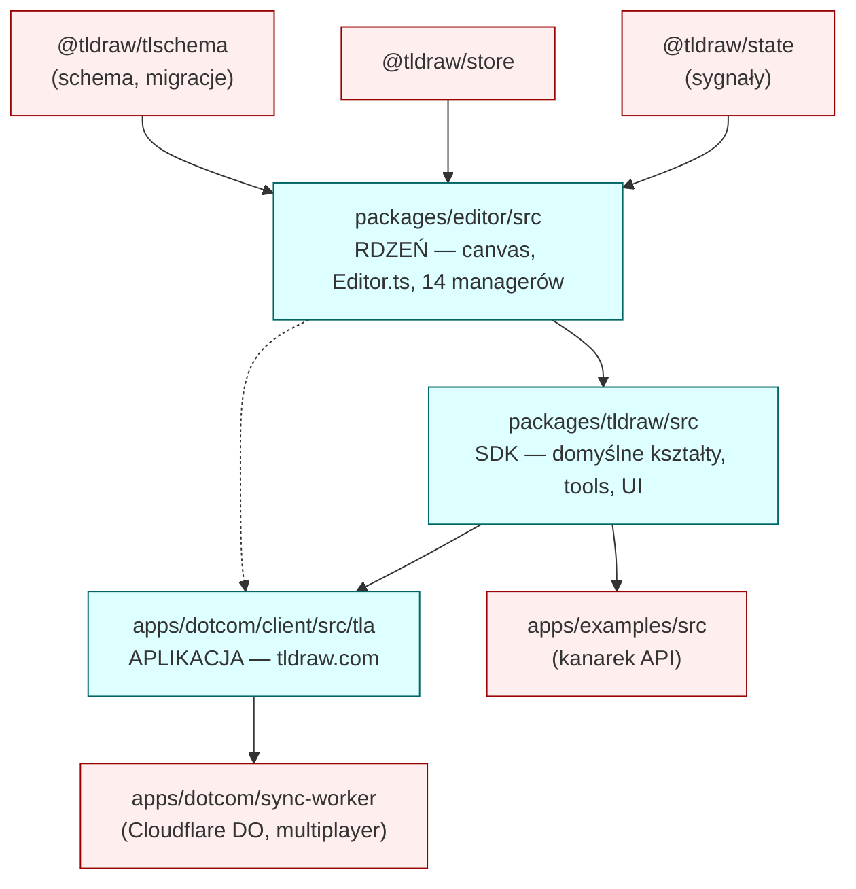

# Mapa repo — tldraw (onboarding architekta)

Synteza trzech perspektyw: **gdzie system żyje** (historia gita) → **jak jest powiązany** (graf importów) → **kogo zapytać** (kontrybutorzy).
Źródła: `artifact-1-territory.md`, `artifact-2-structure.md`, `artifact-3-contributors.md`. Nie powtarzamy ich tabel — tu jest wnioskowanie.

> **Okno analizy:** 12 miesięcy (2025-06-11 → 2026-06-15). To mapa **aktywności i struktury**, nie kompletności. Patrz §7.

---

## 1. TL;DR

tldraw to **monorepo TypeScript (Yarn 4)** z SDK nieskończonego canvasu dla Reacta — rdzeń edytora, pełny SDK z domyślnymi kształtami/UI, oraz aplikacja produktowa tldraw.com. Praca przez rok **oscylowała między rdzeniem SDK a produktem dotcom**: rdzeń (Q1) → wielki push produktowy + nieżyjący już feature `fairy` (Q2) → docs/examples (Q3) → powrót do polishu rdzenia (Q4). Centrum grawitacji to dwa pakiety — `packages/editor/src` i `packages/tldraw/src` — sprzężone najsilniej w całym repo (169 wspólnych commitów). Boli w trzech miejscach: **`Editor.ts` jako God-class** (253+ importów, 14 managerów w konstruktorze, brak izolacji testowej), **`useAppState` jako god-hook dotcom** (51+ konsumentów, brak odpowiednika `TestEditor`), oraz **koncentracja wiedzy** — Steve Ruiz + Mime Čuvalo to ~51% zmian w TOP 3 obszarach. Architektura warstw jest **czysta (0 cykli)**; realne ryzyko to testowalność i bus-factor, nie struktura. Uwaga onboardingowa: ranking churnu jest **zawyżony przez martwy kod** (`fairy`), więc nie należy mu ufać wprost.

> Niebieskie = **objęte grafem zależności**. Czerwone = **poza grafem** (`unknown`, nie „brak powiązań" — patrz §3 i §7).

---

## 2. Teren — gdzie system naprawdę żyje

**Głębokie moduły (duża odpowiedzialność, hands-on):**
- `packages/tldraw/src` — serce SDK: `lib/ui` (610), `lib/shapes` (454), `lib/tools` (192). Najwięcej żywych plików obok examples.
- `packages/editor/src` — rdzeń wokół `Editor.ts` i managerów. Mniejszy plikowo (223 żywych), ale to epicentrum sprzężeń.
- `apps/dotcom/client/src/tla` — realnie żywa część dotcom (workspace, collaboration, file mgmt).

**Płytkie / peryferia:** `apps/examples/src` (najwięcej plików, ale niskie sprzężenie — śledzi tylko SDK), `apps/docs/content`, assety.

**Gdzie struktura katalogów ≠ realna aktywność (pułapki):**
- `apps/dotcom/client` jest **#1 w churnie (~3366)**, ale to **artefakt historii**: licznik napompowany przez tłumaczenia i **`fairy` — feature usunięty w całości** commitem `46ff8124b` (2026-02-05). Po wycięciu fairy obszar jest dużo mniejszy niż sugeruje ranking. **Nie opierać decyzji na pozycji dotcom w churnie.**
- `apps/dotcom/sync-worker/src/TLDrawDurableObject.ts` (30 zmian w historii) **już nie istnieje** — rozbity na `TLFileDurableObject`, `TLUserDurableObject`, `TLStatsDurableObject`, `TLLoggerDurableObject`.
- `packages/fairy-shared/src` (491 zmian) — **usunięty pakiet**.

**Aktywność w czasie:** epicentrum to `Editor.ts` (81 zmian, ~2× częściej niż dowolny inny plik źródłowy). Po nim barrel'e public API (`tldraw/src/index.ts` 55, `editor/src/index.ts` 42) i `TlaEditor.tsx` (48).

---

## 3. Realne powiązania — co zmienia się razem

Trzy rodzaje sprzężeń, **różnej wagi przy szacowaniu kosztu zmiany**:

| Sprzężenie | Skąd wiemy | Waga |
|---|---|---|
| `editor/src` ↔ `tldraw/src` (169 wsp. commitów, 253+/414+ importów) | **git + graf importów** (potwierdzone z obu stron) | 🔴 Ciężkie — ręczna kaskada. Zmiana w rdzeniu rozlewa się waterfall na SDK. |
| `dotcom/client` ↔ `tldraw/src` (97) + ↔ `editor/src` (76) | **git + graf** | 🔴 Ciężkie — dotcom konsumuje SDK; zmiana API ciągnie klienta. |
| `dotcom/client` ↔ `sync-worker` (76) | **tylko git** (worker poza grafem) | 🟠 Full-stack: feature wymaga frontu i backendu razem. Charakter sprzężenia `unknown` po stronie importów. |
| `examples/src` ↔ `tldraw/src` (54), `examples/e2e` ↔ `tldraw/src` (49) | **git** | 🟢 Lekkie, ale to **kanarek API** — gdy pęka publiczne API, examples pękają pierwsze. |
| Barrel'e `index.ts` + `api-report.api.md` | git + graf | 🟢 **Tania regeneracja** — `api-report` zmienia się przez `yarn api-check`, nie ręcznie. Czysty szum przy ocenie kosztu. |
| Tłumaczenia (`main.json`, `defaultTranslation.ts`, dotcom `en.json`) | git | 🟡 **Współzmiana „przez feature z tekstem"**, nie domenowa. Każdy UI-feature dotyka i18n. |
| `.prettierignore`, `.oxlintrc.json`, `eslint.config.mjs` | git | ⚪ **Szum commitów-zamiataczy** (format/lint całego repo). NIE traktować jako sprzężenie domenowe. |

**Cykle:** ✅ **0 cykli** w 2388 modułach / 7633 zależnościach (dep-cruiser). Warstwy są czyste: `editor → tldraw → dotcom`, jednokierunkowo. Istnieją **logiczne** sprzężenia runtime (Editor ↔ managers przez `this.editor`), ale to nie cykle importów.

**Czego graf NIE objął (to `unknown`, nie „czysto"):** `sync-worker`, `sync-core`, `store`, `state`, `tlschema`, warstwa Cloudflare/Zero. Dep-cruiser puszczono tylko na `editor/src`, `tldraw/src`, `dotcom/client/src/tla`. O sprzężeniach tych warstw wiemy **tylko z gita**.

---

## 4. Strefy ryzyka

| # | Strefa | Dlaczego boli |
|---|---|---|
| 1 | **`Editor.ts` (God-class, blast radius)** | 253+ importów + 14 managerów w jednym konstruktorze; zmiana required-param = kaskada do 158 plików `TestEditor`. Naprawa szacowana na 2–4 dni. |
| 2 | **`useAppState` (dotcom god-hook)** | 51+ konsumentów, sięga file/auth/sync; **brak `TestAppState`** — testy komponentów wymagają mockowania całego stacku. Brak centralnego miejsca do trace impact. |
| 3 | **Koncentracja wiedzy (bus-factor)** | Steve Ruiz + Mime Čuvalo = ~51% zmian w TOP 3. Urlop/odejście = projekt zwalnia. |
| 4 | **Sync / Zero (multiplayer)** | Jedyny znający to Mime (i to side-effect); `sync-worker` **bez wyraźnego ownera** i **poza grafem zależności** — podwójna ślepa plama. |
| 5 | **TextManager / Tiptap, SnapManager** | Silos jednoosobowe (Tiptap → Mime; SnapManager → Steve). Zależności zewnętrzne (Tiptap, DOM) + brak unit-testowalności. |
| 6 | **Pasywne, krytyczne obszary** | `bindings`, `migrations`, `tlschema` validators — brak commitów w TOP, brak ownera. Krytyczne dla danych, ale „cicho" — ryzyko regresji bez świadka. |

> Pozytyw do zapamiętania: **ShapeUtil i StateNode to wzory wzorcowo izolowane** (72+ shape utils, tools jako maszyny stanów) — niskie blast radius, łatwe testy. Dobre miejsce na pierwszy PR.

---

## 5. Kogo zapytać (per strefa)

| Strefa | Pierwszy kontakt | Backup |
|---|---|---|
| Editor core / managers / rendering | **Steve Ruiz** (owner) | Mitja Bezenšek (perf), Mime Čuvalo (refactory) |
| Shapes / extensibility / geo | **Mime Čuvalo** | Guillaume Richard |
| Performance (rbush, subscriptions) | **Mitja Bezenšek** | Steve Ruiz |
| Dotcom app / workspace / `useAppState` | **Mitja Bezenšek** | Steve Ruiz |
| Sync / multiplayer / Zero | **Mime Čuvalo** (jedyny) | 🔴 brak backupu |
| Accessibility / i18n | **Mime Čuvalo** | Steve Ruiz (UI) |
| Clipboard / iframe embedding | **David Sheldrick** | Steve Ruiz |
| Tools / gestures / mobile | **Kostya Farber**, **Max Drake** | Steve Ruiz (menu/layout) |

---

## 6. Pierwszy dzień — co przeczytać (w tej kolejności)

1. **`AGENTS.md`** (root) — reguły repo, komendy, gdzie pracować. Twój kontrakt z monorepo.
2. **`packages/editor/src/lib/editor/Editor.ts`** — epicentrum. Zrozum konstruktor i listę managerów, zanim cokolwiek ruszysz.
3. **`packages/editor/src/index.ts`** + **`packages/tldraw/src/index.ts`** — barrel'e public API. Pokazują, co jest publicznym kontraktem (i co pęka szeroko).
4. **Dowolny `ShapeUtil`** — np. `ArrowShapeUtil.tsx` lub `GeoShapeUtil.tsx`. Wzór izolacji + najbezpieczniejsze miejsce na pierwszy PR.
5. **Dowolny tool jako `StateNode`** — np. `SelectTool`. Drugi wzorcowy, dobrze testowalny pattern.
6. **`apps/dotcom/client/src/tla/...` → `useAppState`** + `TlaEditor.tsx` — zobacz, jak aplikacja konsumuje SDK i gdzie zaczyna się god-hook.
7. **`apps/examples/src`** (1–2 przykłady) — najszybszy, izolowany sposób na uruchomienie SDK (`yarn dev`, localhost:5420).
8. **`packages/tlschema/src`** — schema/migracje/validatory; pasywne, ale krytyczne dla danych. Przeczytaj, by wiedzieć, czego nie psuć.

---

## 7. Ograniczenia — czego ta mapa NIE mówi

- **Okno:** tylko 12 miesięcy historii gita. Kod sprzed okna lub stabilny-od-dawna jest **niedoreprezentowany** (np. `migrations`, `bindings` wyglądają „martwo", a są krytyczne — to cisza, nie nieistnienie).
- **Metoda churn:** ranking aktywności jest **zawyżony przez kod usunięty** (`fairy`, stary `TLDrawDurableObject`). Liczby ≠ stan obecny — zawsze sanity-check przez `git ls-files`.
- **Pokrycie grafu zależności:** dep-cruiser objął **tylko 3 obszary** (`editor/src`, `tldraw/src`, `dotcom/client/src/tla`). Dla `sync-worker`, `sync-core`, `store`, `state`, `tlschema`, warstwy Cloudflare/Zero **nie mamy grafu** — ich powiązania to `unknown`, wnioskowane wyłącznie z gita.
- **Współzmiany generowane vs ręczne:** `api-report.api.md` i kompilowane locale zmieniają się **przez regenerację** (tani coupling), nie ręczną edycję — odfiltrowane, ale warto pamiętać przy czytaniu surowej historii.
- **Kontrybutorzy:** to **prognoza z commitów**, warta odświeżania co kwartał. Tożsamości takie jak „alex" (45 commitów) i domena „Lu Wilson" pozostają **nierozpoznane**.

### Znane niewiadome / do głębszego zbadania
- 🔴 **`sync-worker` / multiplayer:** brak ownera **i** brak grafu — najpilniejsza ślepa plama. Kto realnie utrzymuje backend Durable Objects?
- 🟡 **`migrations` + `tlschema` validators:** krytyczne dla integralności danych, pasywne w historii. Kto jest świadkiem zmian schematu?
- 🟡 **`useAppState`:** czy da się rozbić god-hook / dodać `TestAppState`? Ile komponentów dałoby się odciąć od mocka całego stacku?
- 🟡 **`TestEditor` (158 importów):** wzorzec czy pain-point? Czy unit-testowalność Editora da się poprawić bez tego wrappera?
